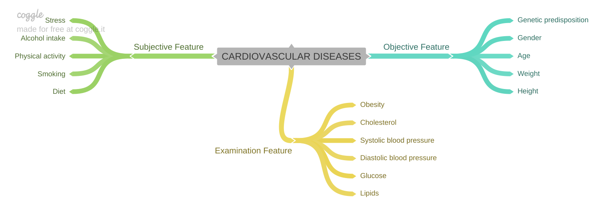

# Cardio_Catch_Diseases

Categorical classification forecast with Machine Learning.

*This Data Science project presents a classification problem of predicting the existence of cardiovascular disease on patients based on a group of objective, subjective and examinational features. For that, 70,000 patient records are going to be considered as part of a fictional healthcare firm called Cardio Catch Diseases. The project was inspired in a database available from a [Kaggle competition](https://www.kaggle.com/sulianova/cardiovascular-disease-dataset).*

(INTRO)

If you wish to check the coding for this project, access the Jupyter Notebook [here](v09-Cardio_Catch_Diseases.ipynb); there is also a Storytelling slide presentation available [here](Project_Storytelling.pdf)

If you want a better understanding on the motivation for this project and a broad view of the main steps taken, then keep on reading!

Here is what I will cover:

- [A brief introduction to CVDs](#a-brief-introduction-to-cdvs)
- [Main outcomes](#main-outcomes)
- 1.[ Business Problem](#business-problem)
- 2.[ Data Description](#data-description)
- 3.[ Feature Engineering](#feature-engineering)
- 4.[ Exploratory Data Analysis](#exploratory-data-analysis)
- 5.[ Machine Learning Models](#machine-learning-models)
- 6.[ Business Performance](#business-performance)

## A brief introduction to CVDs

*To do*

## Main outcomes

*To do*

## 1. Business Problem

Cadio Catch Diseases is a company specialist in detecting heart diseases in its early stages. Its business model is **As-a-Service**, which means that the company offers early diagnosis of cardiovascular disease for a certain price. The firm's price strategy is set as performance-based:

- **The cost of each diagnosis is around $1,000.00** (including the devices and the payroll of the analysts). The price tag for the service varies according to the diagnosis precision achieved by the team of specialists;
  - **The client pays $ 500.00 for every 5% increase in diagnosis precision rate above 50%**. For example, for a precision rate of 55 % the diagnosis costs $ 500.00 for the client, while for a rate of 60 %, the value is 1,000.00;
  - If the diagnostic accuracy is 50% or below, the customer **does not pay** for the service.

One of the main issues is: the variation in precision given by the team of specialists makes the company either have a profitable operation (revenue greater than the cost), or an operation with a loss (revenue less than the cost). This instability of the diagnosis makes the company to have an **unpredictable Cashflow**.

### Business Solution

The objective as a Data Scientist is to create a tool that **increases the precision of the diagnosis and that this precision is stable for all diagnoses**.

Along with the tool, the following questions are going to be answered:
- What is the Accuracy and Precision of the tool?
- How much profit will Cardio Catch Diseases have with the new tool?
- How Reliable is the result given by the new tool?

## 2. Data Description

The used data consists of specific information regarding 70,000 past patients and a target variable indicating the presence or not of cardiovascular disease. The features are all represented in the table below and included:

- Objective features: factual information;
- Subjective features: information given by the patient;
- Examination features: results of medical examination.

Variable | Feature Type	| Variable Name	| Data Type
--- | --- | --- | --- 
Age	| Objective Feature	| age	| numerical, discrete (days)
Height | Objective Feature | height	| numerical, continuous (cm)
Weight | Objective Feature | weight	| numerical, continuous (kg)
Gender | Objective Feature | gender | categorical, binary (labels are unknown)
Smoking	| Subjective Feature | smoke	| categorical, binary
Alcohol intake | Subjective Feature | alco | categorical, binary
Physical activity | Subjective Feature | active | categorical, binary
Systolic | blood pressure	| Examination Feature	| ap_hi	numerical, continuous (mmHg)
Diastolic | blood pressure | Examination Feature	| ap_lo	numerical, continuous (mmHg)
Cholesterol	| Examination Feature	| cholesterol	| 1: normal, 2: above normal, 3: well above normal
Glucose	| Examination Feature	| gluc | 1: normal, 2: above normal, 3: well above normal
Presence or absence of cardiovascular disease | Target Variable | cardio | categorical, binary

### Data Dimensions

By analysing the raw data, the following dimension is found:

- Number of rows: 70000 (which represents the quantity of patients)
- Number of columns: 13 (for how many features are available)

### Descriptive Statistics
Before start working with any Data Science project, it is important to have a general notion of your data, allowing to describe your features in a more broaded extension.

Descriptive statistics allows you to:
- **Gain business knowledge**, from the statistics values such as mean, median, mode etc.;
- **Detect some errors**, such as negative blood pressure, non-viable age, among others. 

It is interesting to split this section into numerical and categorical variables, once they differ in statistical analysis.

#### Numerical variables

From the table above, it is possible to observe some inconsistencies in values, as follows:
- The height variable is between 0.55 m and 2.5 m,
- The weight variable varies from 10 kg to 200 kg,
- The systolic blood pressure presents negatives values,
- As well as the systolic blood pressure, the diastolic blood pressure also presents non-viable results,

**Variable Filtering**:
- The shortest person is 1,25m tall and the tallest person is 2,07m tall.
- The fattest person weighs 180kg and the thinnest person weighs 34kg.
- The youngest person is 30 years old and the oldest person is 65 years old.
- Patients in the dataset present an elevated high blood pressure on average.

#### Categorical variables

## 3. Feature Engineering

*To do*

## 4. Exploratory Data Analysis

*To do*

- **Hypothesis**: 
- **New Features**:

### 1. Univariate Analysis
*To do*

### 2. Bivariate Analysis
*To do*

### 3. Multivariate Analysis
*To do*

## 5. Machine Learning Models

*To do*

### Cross-Validation
*To do*

### Hyperparameter Fine Tuning
*To do*

## 6. Business Performance

*To do*
