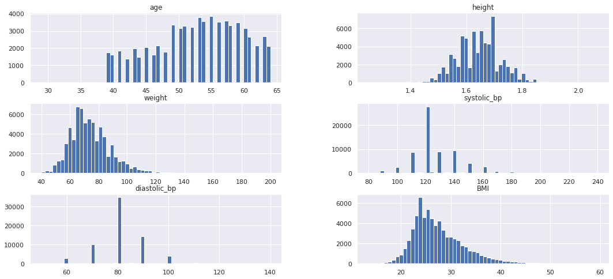
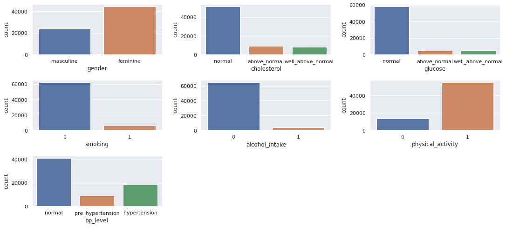

# Cardio_Catch_Diseases

Categorical classification forecast with Machine Learning.

*(This README is under construction :D)*

*This Data Science project presents a classification problem of predicting the existence of cardiovascular disease on patients based on a group of objective, subjective and examinational features. For that, 70,000 patient records are going to be considered as part of a fictional healthcare firm called Cardio Catch Diseases. The project was inspired in a database available from a [Kaggle competition](https://www.kaggle.com/sulianova/cardiovascular-disease-dataset).*

(INTRO) *To do*

If you wish to check the coding for this project, access the Jupyter Notebook [here](v09-Cardio_Catch_Diseases.ipynb); there is also a Storytelling slide presentation available [here](Project_Storytelling.pdf).

If you want a better understanding on the motivation for this project and a broad view of the main steps taken, then keep on reading!

Here is what I will cover:

- [A brief introduction to CVDs](#a-brief-introduction-to-cdvs)
- [1. Business Problem](#1-business-problem)
- [2. Data Description](#2-data-description)
- [3. Feature Engineering](#3-feature-engineering)
- [4. Exploratory Data Analysis](#4-exploratory-data-analysis)
- [5. Data Preparation and Feature Selection](#5-data-preparation-and-feature-selection)
- [6. Machine Learning Models](#6-machine-learning-models)
- [7. Business Performance](#7-business-performance)

## A brief introduction to CVDs

*To do*

## 1. Business Problem

Cadio Catch Diseases is a company specialist in detecting heart diseases in its early stages. Its business model is **As-a-Service**, which means that the company offers early diagnosis of cardiovascular disease for a certain price. The firm's price strategy is set as performance-based:

- **The cost of each diagnosis is around $ 1,000.00** (including the devices and the payroll of the analysts). The price tag for the service varies according to the diagnosis precision achieved by the team of specialists;
  - **The client pays $ 500.00 for every 5 % increase in diagnosis precision rate above 50 %**. For example, for a precision rate of 55 % the diagnosis costs $ 500.00 for the client, while for a rate of 60 %, the value is 1,000.00;
  - If the diagnostic accuracy is 50 % or below, the customer **does not pay** for the service.

One of the main issues is: the variation in precision given by the team of specialists makes the company either have a profitable operation (revenue greater than the cost), or an operation with a loss (revenue less than the cost). This instability of the diagnosis makes the company to have an **unpredictable Cashflow**.

### Business Solution

The objective as a Data Scientist is to create a tool that **increases the precision of the diagnosis and that this precision is stable for all diagnoses**.

Along with the tool, the following questions are going to be answered:
- What is the Accuracy and Precision of the tool?
- How much profit will Cardio Catch Diseases have with the new tool?
- How Reliable is the result given by the new tool?

## 2. Data Description

The used data consists of specific information regarding 70,000 past patients and a target variable indicating the presence or not of cardiovascular disease. The features are all represented in the table below and included:

- Objective features: factual information;
- Subjective features: information given by the patient;
- Examination features: results of medical examination.

Variable | Feature Type	| Variable Name	| Data Type
--- | --- | --- | --- 
Age	| Objective Feature	| age	| numerical, discrete (days)
Height | Objective Feature | height	| numerical, continuous (cm)
Weight | Objective Feature | weight	| numerical, continuous (kg)
Gender | Objective Feature | gender | categorical, binary (labels are unknown)
Smoking	| Subjective Feature | smoke	| categorical, binary
Alcohol intake | Subjective Feature | alcohol_intake | categorical, binary
Physical activity | Subjective Feature | physical_activity | categorical, binary
Systolic blood pressure	| Examination Feature	| systolic_bp | numerical, continuous (mmHg)
Diastolic blood pressure | Examination Feature | diastolic_bp | numerical, continuous (mmHg)
Cholesterol	| Examination Feature	| cholesterol	| 1: normal, 2: above normal, 3: well above normal
Glucose	| Examination Feature	| glucose | 1: normal, 2: above normal, 3: well above normal
Presence or absence of cardiovascular disease | Target Variable | cardio_disease | categorical, binary

### Data Dimensions

By analysing the raw data, the following dimension is found:

- Number of rows: 70000 (which represents the quantity of patients)
- Number of columns: 13 (for how many features are available)

### Descriptive Statistics

Before start working with any Data Science project, it is important to have a general notion of your data, allowing to describe your features in a more broaded extension.

Descriptive statistics allows you to:
- **Gain business knowledge**, from the statistics values such as mean, median, mode etc.;
- **Detect some errors**, such as negative blood pressure, non-viable age, among others. 

It is interesting to split this section into numerical variables (`int64` & `float64`) and categorical variables (`object`), once they differ in statistical analysis.

#### Numerical variables

From the table above, it is possible to observe some inconsistencies in values, in which some features presents non-viable range of results. The following table presents which inconsistencies were found and which range of values was maintained from the raw data, in a process called **variable filtering**:

Feature | Previous range | New range (after filtering)
--- | --- | ---
Height (m) | 0.55 to 2.5 | 1.20 to 2.10
Weight (kg) | 10 to 200 | 40 to 180
Systolic Blood Pressure | -150 to 16020 | 80 to 240
Diastolic Blood Pressure | -70 to 11000 | 50 to 140

Also, it can be seen that the variable `id` does not bring any relevant information regarding the patient's relation to cardiovascular disease, so this feature was removed within the filtering of the data.

#### Categorical variables

This dataset presents a significant amount of categorical variables: `gender`, `cholesterol`, `glucose`, `smoking`, `alcohol_intake` and `physical_activity` (as well as the target variable `cardio_disease`, which was already separately analysed). Let's take a look on how some of the categorical features are related to the main variable:

## 3. Feature Engineering

It is a hard task to find the best way to work with your data, but it normally starts with highlighting relevant information and removing noise. Besides, feature engineering process is very objective: consists of turning raw data into a numeric table without missing values.

For helping on this task, a mindmap that relates objectives, subjectives and examination characteristics to the the risks of having CVD was created.

### **New Features**

By analysing the available data and the mindmap shown above, it is possible to see that some characteristics can be extracted and selected to give origin to new features. Those new features, derived from previous data, can better represent some main issues related to CVD and thus be used effectively in predictive models:
- `bp_level`: categorical, with three labels (`normal`, `pre_hypertension` and `hypertension`), according to the patient's systolic blood pressure;
- `BMI`: numerical, continuous variable indicating the body mass index (BMI) of the patient.

## 4. Exploratory Data Analysis

The Exploratory Data Analysis (also known as EDA) is used to measure the impact of variables in relation to the response variable and, often, to try to quantify that impact. It allows a greater sense of how the data behaves, what data is impacting and what variables should be prioritized in the ML model.

A well-executed EDA allows you to gain business experience, validate market hypotheses (as well as generate insights) and visualize which variables are relevant to the model.

### 4.1. Univariate Analysis
- **Target variable** (`cardio_disease`):
  - Number of patients with CVD: 34,628
  - Number of patients without CVD: 33,933

- **Numerical variables**:

  - The dataset presents a concentration of patients aged 50 to 60;
  - The variable `height`distribution is concentrated around a height of 160cm;
  - The variable `weight` distribution is slightly shifted to the left (positive skew), and the data is concentrated around 70kg;
  - Systolic (`systolic_bp`) and Diastolic (`diastolic_bp`) measurements are concentrated around 120/80mmHg (normal blood pressure);
  - The `BMI` variable's distribution is slightly shifted to the left, concentrated around 25.
  

- **Categorical variables**:

  - There are almost the double of women compared to the quantity of men in the dataset;
  - The quantity of patients with "normal" cholesterol levels are 5x bigger than others, and the same happens to the variable `glucose`;
  - There are almost six times more non-smoker patients than smokers;
  - The quantity of patients who aren't alcohol consumers are 5x bigger than patients who are alcohol consumers;
  - Around 80% of the patients do practise regular physical activities;
  - For the new variable `bp_level`, it is possible to see that more than half of the patients present normal blood pressure levels, whereas the other half contains almost the double of patients with hypertension than patients with pre-hypertension.

### 4.2. Bivariate Analysis

From the previous researches made in CVD and by using the MindMap shown in the [Feature Engineering](#feature-engineering) section of this *readme*, nine hypothesis for how the given features on this dataset are related to the target variable were created, and by using EDA it was possible to decide whether the hypothesis is true or false for the case study and try to understand what level of impact it may have on the model (low, medium, high).

The list of hypothesis can be found in the table below. For more details on the Bivariate EDA, please check the [Jupiter Notebook code](v09-Cardio_Catch_Diseases.ipynb).

Hypothesis                                                                                             | Conclusion   | Relevance
------------------------------------------------------------------------------------------------------ | ------------ | -----------
H1. **Men** are **most likely** to present cardiovascular diseases                                             | True         | Low
H2. People with **obesity** are **most likely** to present cardiovascular diseases                             | True         | High
H3. **Older people** are **most likely** to present cardiovascular diseases                                    | True         | High
H4. People who **drink alcohol** are **most likely** to present cardiovascular diseases                        | False        | Low
H5. People who **practice regular physical activities** are **less likely** to present cardiovascular diseases | True         | Low
H6. People who **smoke** are **most likely** to present cardiovascular diseases                                | False        | Low
H7. People who **present high cholesterol** levels are **most likely** to present cardiovascular diseases      | True         | High
H8. **High glucose levels** people are **most likely** to present cardiovascular diseases                      | True         | Medium
H9. People with **hypertension** are **most likely** to present cardiovascular diseases                        | True         | High

### 4.3. Multivariate Analysis

For the multivariate analysis, the following correlation methods were used:
1. Pearson Correlation Coefficient, for numerical variables;
2. Cramér's V Correlation, for categorical variables (including the binary target variable).

#### Numerical variables

From the heatmap shown above, it is possible to see that:
- There is a strong positive correlation between `weight` and `BMI` (expected, since one is derived from the other), as well as between `systolic_bp` and `diastolic_bp`;
- A weak but negative correlation is observed between `height` and `BMI`;
- The correlation between `BMI` and `age`, `weight` and `age`, `diastolic_bp`/`systolic_bp` and `height` is almost nule.

#### Categorical variables

Here are some observations for the target variable `cardio_disease`:
- It has a mild positive correlation with `bp_level`;
- Presents a weak positive correlation with  `cholesterol`;
- Has an almost zero correlation with the remaining categorical variables: `gender`, `glucose`, `smoking`, `alcohol_intake` and `physical_activity`.

## 5. Data Preparation and Feature Selection

The learning of ML algorithms is facilitated by the insertion of numerical data that are presented in the same scale, once:
- Most ML algorithms work with optimization methods, which use many mathematical operations such as derivatives, sums, multiplications, among others, whereas the use of categorical variables becomes inviable;
- The derivatives applied in most of these algorithms benefit variables with greater range (e.g. descending gradient of neural networks), giving greater importance to them; therefore, it is crucial to normalize those variables, as a way to inform the algorithm that they have the same information content.

Therefore, this section is focused on the tools applied for both cases: either adapting the range of the variables by rescaling or converting categorical variables in numerical ones using encoding methods.

### Data Preparation

- **Rescaling**: MinMaxScaler(), RobustScaler()
- **Encoding**: OrdinalEncoder

### Feature Selection

ML models learn best from a simpler dataset, and the simplicity of a dataset lies in the number of columns (features) that the dataset presents.

This is where feature selection comes in: it is a method that uses algorithms in order to identify the relevance of the variables.

In this section, the dataset was split into training and test datasets, in a randomly manner with a test size of 20 % of the original dataset.

The feature selector used was **Boruta**, and this wrapper method-based algorithm has selected only one variable: `bp_level`. By adding the other Hypothesis table's features from the exploratory data analysis, the features to be trained are going to be `bp_level`, `age`, `cholesterol` and `BMI`.

## 6. Machine Learning Models

Since this project aims to predict the existence or not of CVD by analysing labeled features, it requires a **supervised classification ML model**. Knowing that, three models are going to be tested and further compared:
- Logistic Regression
- Random Forest Classifier
- Support Vector Classifier

*To complete*

### Cross-Validation
Choosing only one test dataset to define the performance of a model can lead to inaccurate results. Therefore, it is important to define the real performance of the machine learning models, understanding all the variability of the phenomenon from the measurement of the model's performance over various groups of data over the evaluated dataset. This technique of dividing the data set into several different subsets for testing the ML model is called Cross-Validation.

*To complete*

### Hyperparameter Fine Tuning
*To do*

## 7. Business Performance

Overall, as shown in the previous section, the chosen model generates CVD predictions with a precision rate between **xx.xx %** and **xx.xx %**. 

From the informations given in the [Business Problem section](#1-business-problem), it is possible to conclude that:
- The current operation (software solution) would have **a debt of around $ 35 million in the worst scenario**, and would have **a profit of around $ 35 million in the best scenario**;
- Under the model built in this project, the firm would never present deficit values: **in the worst scenario**, it would present **a profit of around $ xx million**; **in the best scenario**, **profit would be $ xx million**.

For answering the three initial questions that motivated this project:
- *What is the Accuracy and Precision of the tool?*
  - The ___ model used presents **an accuracy of xx.xx %** and **a precision of xx.xx %**.
- *How much profit will Cardio Catch Diseases have with the new tool?*
  - Considering the best scenario, the company would have a profit of **$ xx.xx million**
- *How Reliable is the result given by the new tool?*
  - *To do*
